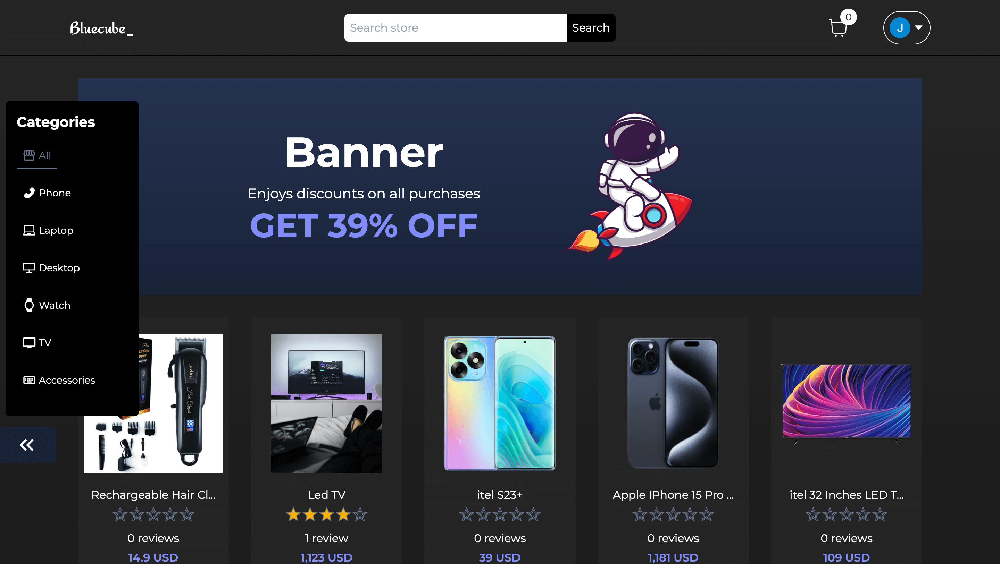

<!-- PROJECT LOGO -->
<br />
<p align="center">
  <a href="https://github.com/gilbertoaceville/c-commerce-store">
    
  </a>

  <h3 align="center">Bluecube E-commerce</h3>

  <p align="center">
    Sample e-commerce application built with Next.js, Prisma and Stripe
    <br />
    <br />
    <a href="https://github.com/gilbertoaceville/c-commerce-store/issues">Report Bug</a>
    ·
    <a href="https://github.com/gilbertoaceville/c-commerce-store/issues">Request Feature</a>
  </p>
</p>

<!-- TABLE OF CONTENTS -->
<details open="open">
  <summary><h2 style="display: inline-block">Table of Contents</h2></summary>
  <ol>
    <li>
      <a href="#about-the-project">About The Project</a>
      <ul>
        <li><a href="#built-with">Built With</a></li>
      </ul>
    </li>
    <li>
      <a href="#screenshots">Screenshots</a>
    </li>
    <li>
      <a href="#getting-started">Getting Started</a>
      <ul>
        <li><a href="#prerequisites">Prerequisites</a></li>
        <li><a href="#env-variables">Environment Variables</a></li>
        <li><a href="#installation">Installation</a></li>
      </ul>
    </li>
    <li><a href="#roadmap">Roadmap</a></li>
    <li><a href="#contact">Contact</a></li>
  </ol>
</details>

<!-- ABOUT THE PROJECT -->

## About The Project

**Next.js E-commerce** is an example online shop built with React.js and Keystone.js.

### Built With

- [Next.js](https://nextjs.org/) (React.js framework)
- [Typescript](https://www.typescriptlang.org/)
- [Prisma](https://www.prisma.io/)
- [Firebase](https://firebase.google.com/)
- [Mongo DB](https://www.mongodb.com/cloud/atlas)
- [Next Auth](https://next-auth.js.org/)
- [React Hook Form](https://react-hook-form.com/)
- [Material UI](https://mui.com/)
- [Stripe](https://stripe.com)
- [Axios](https://axios-http.com/)
- [Tailwindcss](https://tailwindcss.com/)
- [Chart.js](https://www.chartjs.org/)

**Some features**:

- Role-based Permissions (only a admins can see or access the admin page and can perform actions there in (Add a product, delete a product, see orders), etc.)

#### Admin Panel
 - Add a product ✔
 - View Product ✔
 - Delete a Product ✔
 - Update product ✔
 - Add a Category ✔
 - Dispatch Order ✔
 - Handle Order Delivery  ✔
 - Pending Order  List ✔
 - Completed Order List ✔
 - Toggle Product In Stock ✔
 - See stats/summary of order ✔ 


#### Customer
- View Product & Category ✔
- Search category By name ✔
- Search product by category Name ✔
- View product related to specific category ✔
- Add product to cart ✔
- Remove Product from cart ✔
- Increase Decrease cart Item  Quantity ✔ (IF product Instock Quantity is less then your cart quantity then you are unable to  increase that product Quantity)
- Alert if InStock Quantity isn't Available ✔
- Order a Product ✔
- Track Order Status ✔
- View Order Detail ✔

- User authentication handled by [Next Auth](https://next-auth.js.org/) with Google provider as a credential; Authorization validation for Admin Access and Customer Access
- [Prisma](https://www.prisma.io/) for interaction with [Mongo DB](https://www.mongodb.com/cloud/atlas) database.
- [Firebase](https://firebase.google.com/) for storing image files attached when creating products in admin space
- [Stripe](https://stripe.com) for payment intent gateway and payment integrations with a webhook that updates orders if payment intent succeeded
- Form Validation with [React Hook Form](https://react-hook-form.com/)
- Automatic Deployment via Vercel and Github CI
- Testing with [React Testing Library](https://testing-library.com/docs/react-testing-library/intro/) and Jest

<!-- SCREENSHOTS  -->

## Screenshots

You can find more screenshots in the [screenshots/](./public/screenshots/) folder.



<!-- GETTING STARTED -->

## Getting Started

To get a local copy up and running follow these steps.

### Prerequisites

- [node & npm](https://nodejs.org/en)

### Environment Variables

To run this project, you will need to add the following environment variables to your .env file

DATABASE_URL= Your mongoDB URL

NEXTAUTH_SECRET= Custom auth secret
NEXTAUTH_URL= Base URL for localhost => http://localhost:3000

GOOGLE_CLIENT_ID= Google console id
GOOGLE_CLIENT_SECRET= Google console secret

NEXT_PUBLIC_STRIPE_PUBLISHABLE_KEY= Stripe publishable key
STRIPE_SECRET_KEY=
STRIPE_WEBHOOK_SECRET= Stripe Webhook secret for automatic order update

NEXT_PUBLIC_SITE= Base URL for localhost => http://localhost:3000

FIREBASE_API_KEY=
FIREBASE_MESSAGE_SENDER_ID=
FIREBASE_APP_ID=

### Installation

1. Clone the repo

   ```sh
   git clone https://github.com/gilbertoaceville/c-commerce-store.git
   ```

2. Install NPM packages

   ```sh
   npm install
   ```

3. Start Project

   ```sh
   npm run dev - Mostly on localhost => http://localhost:3000
   ```

<!-- ROADMAP -->

## Roadmap

See the [open issues](https://github.com/sophiabrandt/nextjs-ecommerce/issues) for a list of proposed features (and known issues).

<!-- CONTACT -->

## Contact

Gilbert James - [james-gilbert-ace](https://www.linkedin.com/in/james-gilbert-ace/)

Project Link: [https://github.com/gilbertoaceville/c-commerce-store](https://github.com/gilbertoaceville/c-commerce-store)

Website Link: [C Commerce Store](https://c-commerce-store.vercel.app/)
